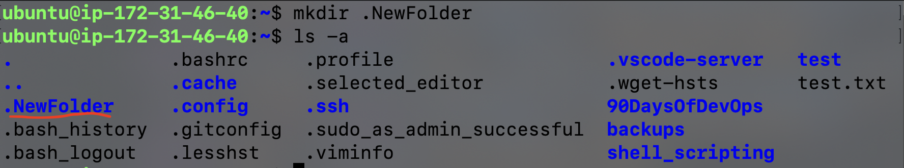

# Basic Linux Commands

### listing command
```ls <options> <arguments>``` -> list all sub directories and file in present directory

Examples:

- ``` ls -l ```--> list the files and directories in long list format with extra information


- ```ls -a ```--> list all including hidden files and directory


- ```ls *.sh``` --> list all the files having .sh extension.


- ```ls -i ``` --> list the files and directories with index numbers inodes


- ``` ls -d */``` --> list only directories.(we can also specify a pattern)


### Directory Commands
- ```pwd``` --> shows present working directory


- ```cd path_to_directory``` --> change directory to the provided path


- ```cd ~ ``` or just  ```cd ``` --> change directory to the home directory


- ``` cd - ``` --> Go to the last working directory.


- ``` cd ..``` --> change directory to one step back.


- ``` cd ../..``` --> Change directory to 2 levels back.


- ``` mkdir  directoryName``` --> to make a directory in a specific location


- ``` mkdir .NewFolder ``` --> Make a hidden directory (also . before a file to make it hidden)


- ```mkdir A B C D ``` --> Make multiple directories at the same time.


- ```mkdir -p  E/F/G ``` --> Make a nested directory


### Copy Command
```cp <src path> <dest path>``` --> copy source files and directories to destination

### Move Command
- ```mv <src path> <dest path>``` --> copy source files to destination

- ```mv <old file> <new file with new name>``` --> rename the file