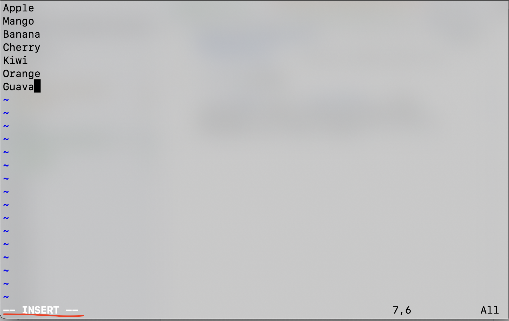
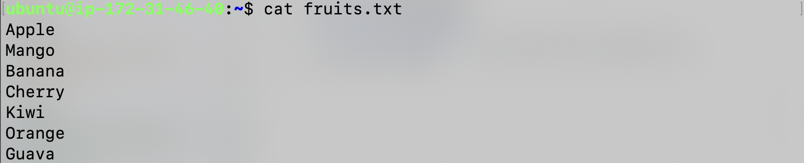
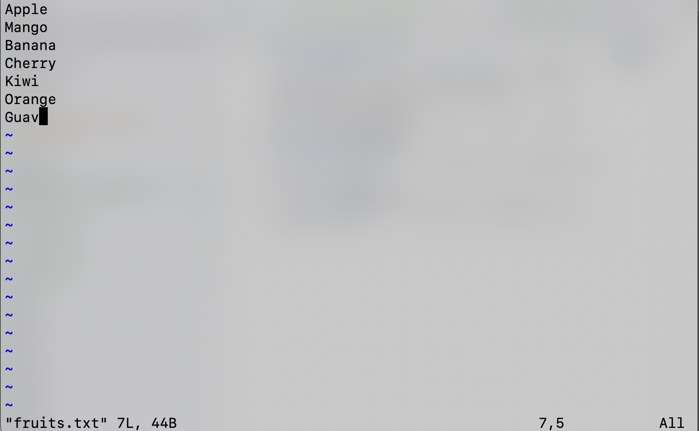

# Basic Linux Commands Part 2
### Create file
```touch <filename>``` -> this will create any kind of file

### Add content in file
```vi <filename>``` or ```vim <filename>``` -> after executing this command, vim editor will open, to write content press 'i' to enter in insert mode.

Once writing is finish press 'esc' -> ':wq!' -> 'enter'

### View file's content
- ```cat <filename>``` -> by executing this command we can view file's content

- ```vi <filename>``` -> we can use vi command to see contents of file

### View only top few lines from file
```head -n <no. of lines> <filename>``` -> this command shows mentioned number of lines from top

### View only bottom few lines from file
```tail -n <no. of lines> <filename>``` -> this command shows mentioned number of lines from top

### Remove file or directory
- ```rm <filename>``` -> this command removes mentioned file
- ```rm <file1> <file2>``` -> use of this command removes multiple files
- ```rmdir <dirname>``` -> this will removes only empty directory
- ```rm -r <dirname>``` -> this will removes empty as well as non empty directory
### Check previous commands
```history``` -> this command gives commands which you have run till now
### Difference between two files
```diff <file1> <file2>``` -> shows diff between two files