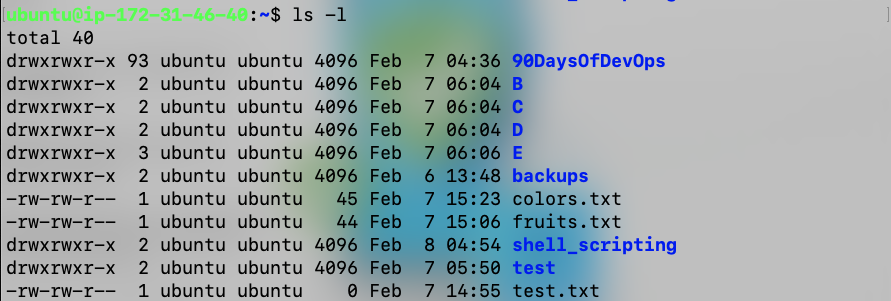
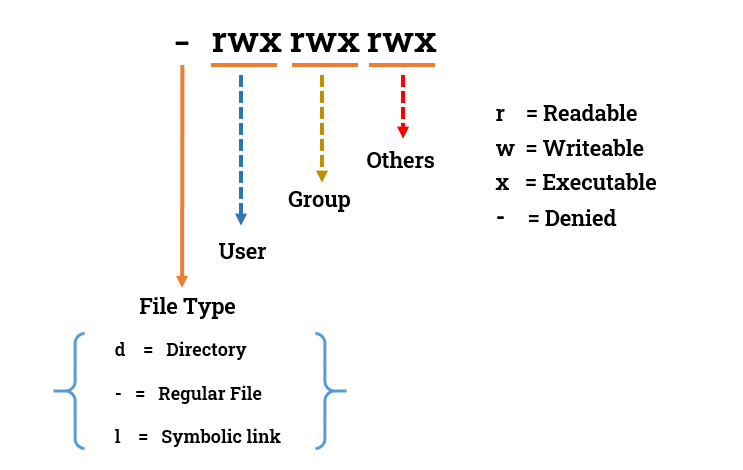

# Advance Linux Commands
### On Day 3 learn advance linux commands as
- User management

    ```
    A user is an entity, in a Linux operating system, that can manipulate files and perform several other operations.
    Each user is assigned an ID that is unique for each user in the operating system.
    After installation of the operating system, the ID 0 is assigned to the root user and
    the IDs 1 to 999 (both inclusive) are assigned to the system users and hence the ids for local user begins from
    1000 onwards.

    In a single directory, we can create 60,000 users.
    ```

- Group management
    ```
    There are 2 categories of groups in the Linux operating system i.e. Primary and Secondary groups.
    The Primary Group is a group that is automatically generated while creating a user with a unique user
    ID simultaneously a group with an ID the same as the user ID is created and the user gets added to the
    group and becomes the first and only member of the group. This group is called the primary group.
    A secondary group is a group that can be created separately with the help of commands and we can then
    add users to it by changing the group ID of users.
    ```
- grep, awk, find commands
    
    - grep
        ```
        The grep filter searches a file for a particular pattern of characters and displays all lines
        that contain that pattern. The pattern that is searched in the file is referred to as the regular
        expression (grep stands for global search for regular expression and printout). 
        ```
    - find
        ```
        The find command in Linux is a dynamic utility designed for comprehensive file and directory searches
        within a hierarchical structure. Its adaptability allows users to search by name, size, modification time,
        or content, providing a flexible and potent solution.
        ```
    - awk
        ```
        Awk is a scripting language used for manipulating data and generating reports. The awk command programming
        language requires no compiling and allows the user to use variables, numeric functions, string functions, and logical operators. 

        Awk is a utility that enables a programmer to write tiny but effective programs in the form of statements that
        define text patterns that are to be searched for in each line of a document and the action that is to be taken
        when a match is found within a line. Awk is mostly used for pattern scanning and processing.
        It searches one or more files to see if they contain lines that matches with the specified patterns and then
        perform the associated actions. 

        Awk is abbreviated from the names of the developers – Aho, Weinberger, and Kernighan. 

        What can we do with AWK?
        1. AWK Operations: 
        (a) Scans a file line by line 
        (b) Splits each input line into fields 
        (c) Compares input line/fields to pattern 
        (d) Performs action(s) on matched lines 

        2. Useful For: 
        (a) Transform data files 
        (b) Produce formatted reports 

        3. Programming Constructs: 
        (a) Format output lines 
        (b) Arithmetic and string operations 
        (c) Conditionals and loops

        Built in variables in awk
        Awk’s built-in variables include the field variables—$1, $2, $3, and so on ($0 is the entire line) —
        that break a line of text into individual words or pieces called fields. 

        NR: NR command keeps a current count of the number of input records. Remember that records are usually lines.
            Awk command performs the pattern/action statements once for each record in a file. 
        NF: NF command keeps a count of the number of fields within the current input record. 
        FS: FS command contains the field separator character which is used to divide fields
            on the input line. The default is “white space”, meaning space and tab characters.
            FS can be reassigned to another character (typically in BEGIN) to change the field separator. 
        RS: RS command stores the current record separator character. Since, by default, an input
            line is the input record, the default record separator character is a newline. 
        OFS: OFS command stores the output field separator, which separates the fields when Awk prints them.
            The default is a blank space. Whenever print has several parameters separated with commas,
            it will print the value of OFS in between each parameter. 
        ORS: ORS command stores the output record separator, which separates the output lines when Awk prints them.
        The default is a newline character. print automatically outputs the contents of ORS at the end of whatever it is given to print. 
        ```
- file permission commands

    
   There’s a lot of information in those lines. 

    1. The first character indicates it is file or directory.
    2. The next nine characters (rw-r–r–) shows the security.
        
        

    3. The next column shows the owner of the file. (Here it is `root`)
    4. The next column shows the group owner of the file. (Here it is `root` which has special access to these files)
    5. The next column shows the size of the file in bytes.
    6. The next column shows the date and time the file was last modified.
    Last Column = File_name or Directory_name. (For example, here 90DaysOfDevOps, B, C, test.txt etc...)

***Note***: [Please check for reference](./advance_linx_commands.md)

[← Previous Day](../day-3/README.md) | [Next Day →](../day-5/README.md)
