# Advance Linux Commands
### User Management
- ```cat /etc/passwd``` -> this command shows list of all users in system

    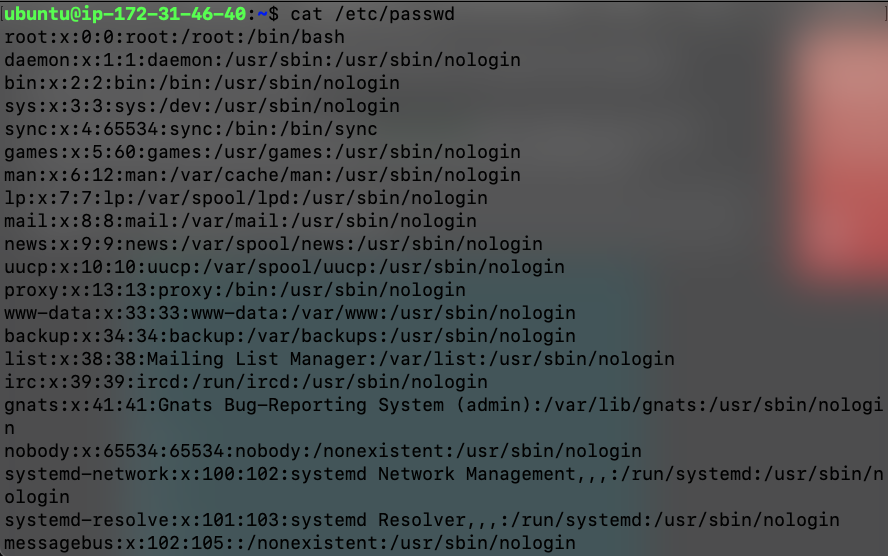

    The info about user is in specific format as:
    ```
    username : x : user id : user group id : : /home/username : /bin/bash 
    ```

- ```id <username>``` -> by using this command we can get id of user

    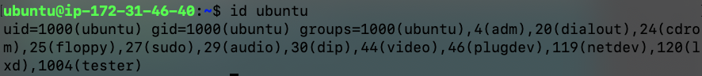

- ```sudo useradd -m <username>``` -> this will create user with mentioned username

    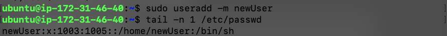

- ```passwd <username>``` -> this will set password of user 

    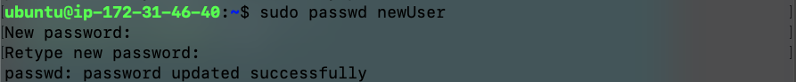

- ```sudo userdel -r <username>``` -> this command deletes mentioned user. If the user is part of a group then it will not be deleted directly, hence we will have to first remove him from the group and then we can delete him.

    

### Group Management
- ```sudo groupadd <groupname>``` -> this will creates group with mentioned name

    

- ```sudo usermod -G <groupname> <username>``` -> this command adds user to existing group

    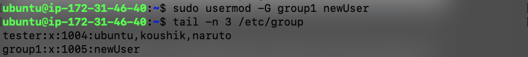

    ***note: If we add a user to a group then it automatically gets removed from the previous groups, we can prevent this by the command given below***

- ```sudo usermod -G <groupname> <username>``` -> this command adds user to existing group without removing previous groups

    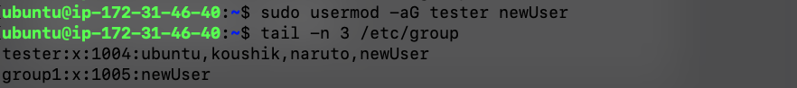

- ```sudo gpasswd -M <user1>, <user2> ... <group>``` -> To add multiple users to a group simultaneously, you can utilize the gpasswd command with the -M option. This command allows you to specify a list of usernames separated by commas.

    ***note: this will overwrite existing users in group***

### grep, find, awk commands
- grep command ```grep <options> pattern <files>```
    ```<options>```: These are command-line flags that modify the behavior of grep. 

    ```<pattern>```: This is the regular expression you want to search for. To know more about regular expresion [click here](https://www.geeksforgeeks.org/write-regular-expressions/).
    
    - case insensetive search

        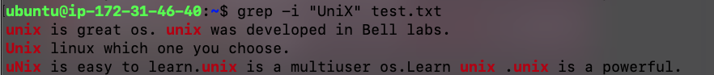
    
    - Displaying the count of number of matches

        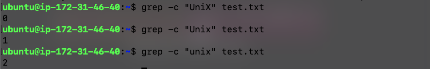

    - Display the file names that matches the pattern

        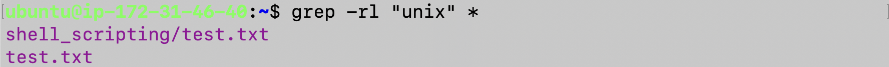
    
    - Checking for the whole words in a file

        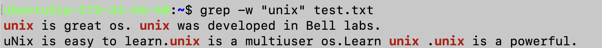

    - Show line number while displaying the output using grep -n

        
    
    - Matching the lines that start with a string

        

    - Matching the lines that end with a string

        

- find command

    ```find <path> <options> <expression>```

    path: Starting directory for the search.
    Example: find /path/to/search

    options: Additional settings or conditions for the search.
    Example: find /path/to/search -type f -name "*.txt"

    expression: Criteria for filtering and locating files.
    Example: find /path/to/search -type d -name "docs"

    - Find A Specific File
        
        in below example, it seeks "test.txt" within current folder

        
    
    - Search Files with a Pattern Using

        In this case, it identifies files ending with ‘.txt’ within the current directory.

        
    
    - Empty Files and Directories

        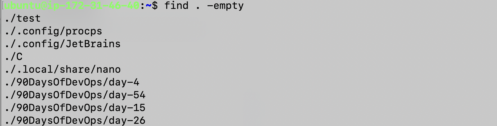
    
- awk command

    Consider following content of file employee.txt
    ```
    ajay manager account 45000
    sunil clerk account 25000
    varun manager sales 50000
    amit manager account 47000
    tarun peon sales 15000
    deepak clerk sales 23000
    sunil peon sales 13000
    satvik director purchase 80000
    ```

    - Default behavior of Awk: By default Awk prints every line of data from the specified file.

        ```awk '{print}' employee.txt```
    
    - Print the lines which match the given pattern.
        
    
    - Printing specfic columns
        

    - Display Line Number
        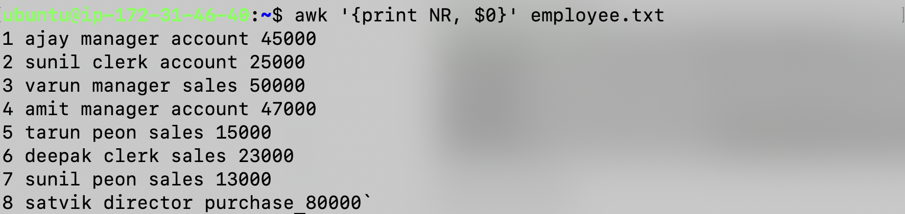

    - Display Line From specific line number to specific line number
        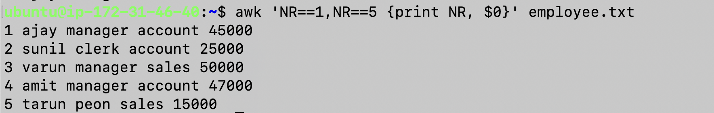

- file permission
    
    ```chmod <permisions> <file/directory>``` to change permissions of file/directory we can use command

    we can cahnge file permission's using to way one is using letters and other is using numbers (octal)

    - using letters
        
        - to give either read or write or execute permisson to user/group/other, following are the exapmles

            - ```chmod u+w <file/directory>``` -> this will append write permission to user for mentioned file/dir
            - ```chmod o+x <file/dirr>``` -> this will append execute permission to others for mentioned file/dir
            - ```chmod u+w,g+r,o+x <file/dir>``` -> this will append write permission to user, read permision to group and execute permission to others for mentioned file/dir
            - ```chmod o-x <file/dir>``` ->this will remove execute permission from user for mentioned file/dir
    
    - using numbers
        
        for numeric permission following table is required
        |Octal|Binary|Permissions|
        |:-:|:-:|:-:|
        |0|000|---|
        |1|001|--x|
        |2|010|-w-|
        |3|011|-wx|
        |4|100|r--|
        |5|101|r-x|
        |6|110|rw-|
        |7|111|rwx|

        in short, we can say value for 'r' is '4', value for 'w' is '2' and value for 'x' is '1', using sumation we can assign permissions

        - ```chmod 755 <file/dir>``` means
        user has all permissions i.e rwx: 4 + 2 + 1 = 7
        group has read and execute permissions not write i.e r-x: 4 + 1 = 5
        similar to others