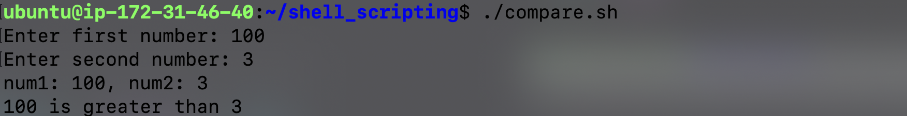

# Linux Shell Scripting Part 1
Before start learning linux shell scripting let's dive into following three concepts
    
### What is kernel?

Kernel is core component of an operating systemwhich manages operations of computer and hardware. Kernel acts as a bridge between applications and data processing performed at hardware level using inter-process communication and system calls. It is computer program.

In short kernel communicates with hardware over shell commands.

### What is shell?

A shell is special user program which provide an interface to user to use operating system services. Shell accept human readable commands from user and convert them into something which kernel can understand. It is a command language interpreter that execute commands read from input devices such as keyboards or from files. The shell gets started when the user logs in or start the terminal.

### What is linux shell scripting? 

A shell script is a computer program designed to be run by a linux shell, a command-line interpreter. The various dialects of shell scripts are considered to be scripting languages. Typical operations performed by shell scripts include file manipulation, program execution, and printing text.

So from above point we knew that shell scripting is programming language. But what is importance of shell script for DevOps engineer? Why DevOps engineer must know it? Let's see below point.

### What is Shell Scripting for DevOps?

Shell script is set of commands/computer program which can be used by DevOps engineer to automate repetitive tasks, streamlining deployment and management of application.

For example, there is task to backup log files of application and send them to another server. In this scenario DevOps engineer can write the shell script which executes this task.

### Basic scripts
- Hello World Script

    ``` bash
        #!/bin/bash

        echo "Hello World!!!"
    ```
    

- User input and print

    ``` bash
        #!/bin/bash

        read -p "Enter your name: " name

        echo "$name"
    ```
    

- Compare two numbers

    ``` bash
        #!/bin/bash

        read -p "Enter first number: " num1

        read -p "Enter second number: " num2
        echo "num1: $num1, num2: $num2"
        if [ $num1 -gt $num2 ]
        then
                echo "$num1 is greater than $num2"
        elif [ $num1 -lt $num2 ]
        then
                echo "$num2 is greater than $num1"
        else
                echo "$num1 and $num2 are equal"
    ```

    

From above scripts what is first line i.e. ```#!/bin/bash ```

### What is Shebang?

In computing, a shebang is the character sequence consisting of the characters number sign and exclamation mark (#!) at the beginning of a script. It is also called sharp-exclamation, sha-bang, hashbang, pound-bang or hash-pling.

When a text file with a shebang is used as if it is an executable in a Unix-like operating system, the program loader mechanism parses the rest of the file's initial line as an interpreter directive. The loader executes the specified interpreter program, passing to it as an argument the path that was initially used when attempting to run the script, so that the program may use the file as input data. From above scripts first line i.e. ```#!/bin/bash``` means program loader is instructed to use bash shell to run program.

We can use ```#!/bin/sh``` instead of ```#!/bin/bash```

[← Previous Day](../day-4/README.md) | [Next Day →](../day-6/README.md)