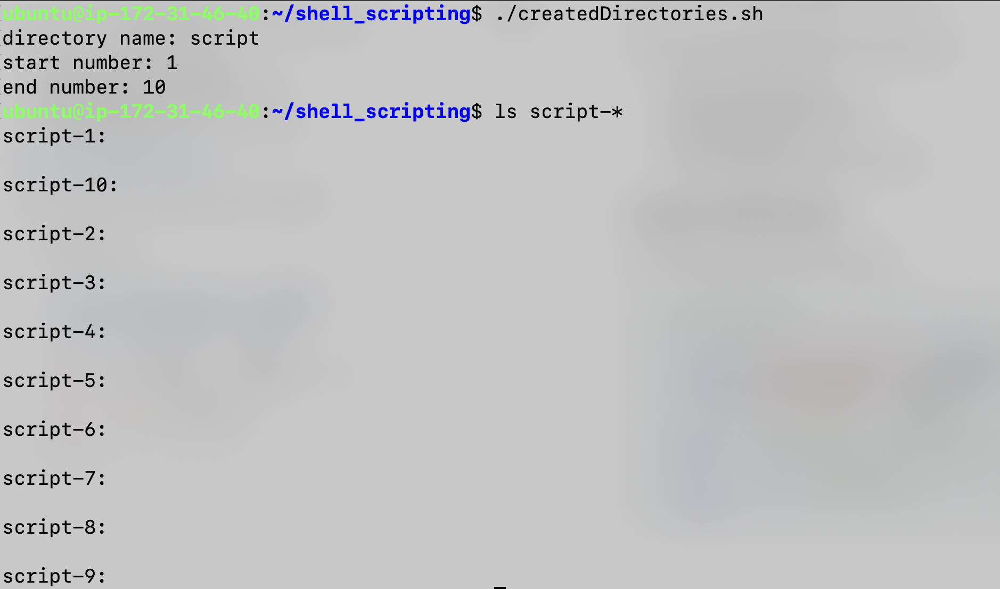
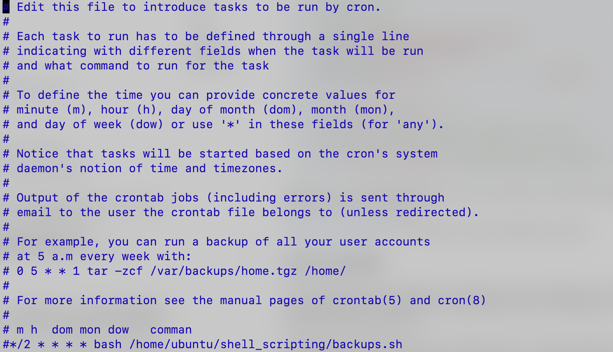

# Linux Scripting Part 2

On day-6 of 90DaysOfDevOps we will dive into

- loops in shell scripting
- Shell script for backuping file
- Cron and Crontab
- Project

## Loops in Shell Script

Let's create directories day1 to day90

``` bash
    #!/bin/bash

    read -p "directory name: " dirName
    read -p "start number: " startNum
    read -p "end number: " endNum

    for (( i=$startNum ; i<=$endNum ; i++ ))
    do
            mkdir $dirName-$i
    done
```



## Backup file script

```bash
    #!/bin/bash

    # backup script

    src_dir="/home/ubuntu/shell_scripting"
    tgt_dir="/home/ubuntu/backups"

    bkp_filename="backup_$(date +%Y%m%d_%H-%M).tar.gz"


    echo "Backup started ....."

    tar -czvf "${tgt_dir}/${bkp_filename}" "$src_dir"

    echo "Files are backup to ${tgt_dir}/${bkp_filename}"
```

variable 'src_dir' is directory path which you want to backup and variable 'tgt_dir' is directory where you want to save backup file.

[Check out this reference](https://www.geeksforgeeks.org/tar-command-linux-examples/) for tar command or execute ```man tar``` command.

## Cron or Crontab

Cron is the system's main scheduler for running jobs or tasks unattended. A command called crontab allows the user to submit, edit or delete entries to cron. A crontab file is a user file that holds the scheduling information.

```crontab -e``` execute this command. It will open one file -> scroll all over down -> paste your script then that script will execute in specified time interval.



To set time interval refer [crontab.guru](https://crontab.guru/)

## Project

I have developed project using shell script. This project is on user and group management. Project covers following points

- While loop
- if-else if-else
- Modularity in shell scripts
- Switch case

[Project-1](https://github.com/KoushikMaharaj/DevOpsProjects/tree/master/project-1)

[← Previous Day](../day-5/README.md) | [Next Day →](../day-7/README.md)
