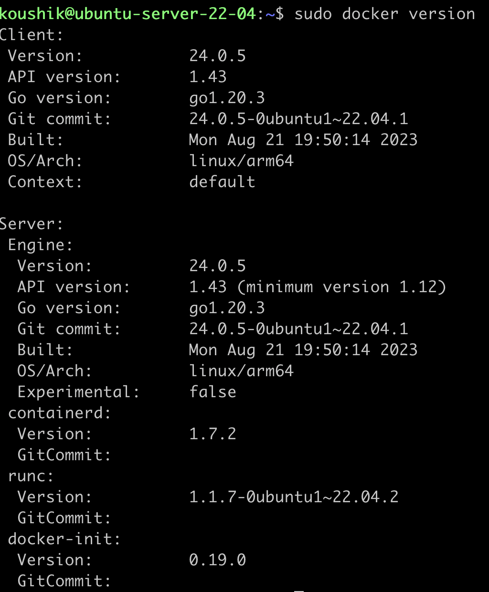
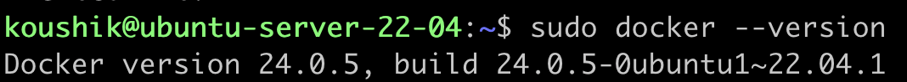
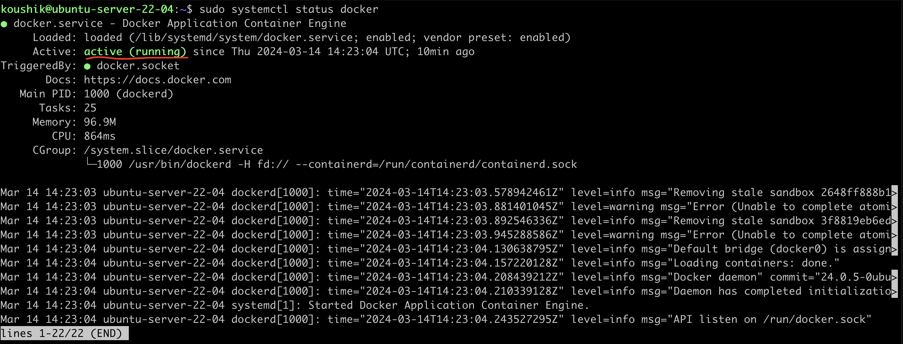
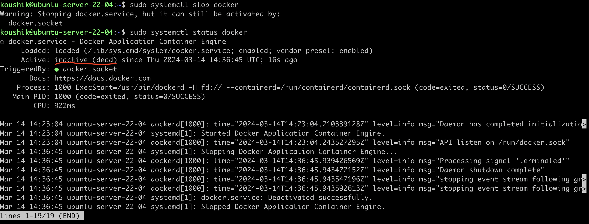

# Understanding package manager and systemctl

## What is Package?

Application software is delivered in units called packages. A package is a collection of files and directories required for a software product, and is usually designed and built by the application developer after completing the development of the application code. A software product needs to be built into one or more packages so that it can easily be transferred to a distribution medium, be mass produced, and installed by administrators.

## What is package manager?

A package manager keeps track of what software is installed on your computer, and allows you to easily install new software, upgrade software to newer versions, or remove software that you previously installed. As the name suggests, package managers deal with packages: collections of files that are bundled together and can be installed and removed as a group.

## Different kinds of package managers

Package Managers differ based on packaging system but same packaging system may have more than one package manager.

For example, RPM has Yum and DNF package managers. For DEB, you have apt-get, aptitude command line based package managers.

## Now let's try to install docker

I am installing docker on Ubuntu-22.04. Ubuntu uses apt-get package manager.

- First update exisiting package using following command

    ```bash
        sudo apt-get update
    ```

- Install docker

    ```bash
        sudo apt-get docker.io
    ```

- Check docker is installed or not

    ``` bash
        sudo docker version
    ```

    

    you can use following command also

    ```bash
        sudo docker version
    ```

    

- Add user to docker group to avoid 'sudo' as prefix for docker command

    ``` bash
        sudo usermod -aG docker $USER
    ```

- For Centos

    Centos uses yum package manager

    ```bash
        sudo yum update
        sudo yum install docker.io
    ```

## systemctl and systemd

systemctl is used to examine and control the state of “systemd” system and service manager. systemd is system and service manager for Unix like operating systems(most of the distributions, not all).

- we can check status of any service using systemctl command. Let's check status of docker that we have installed

    ```bash
        sudo systemctl status docker
    ```

    

- we can stop any service using systemctl

    ```bash
        sudo systemctl stop docker
    ```

    

The systemctl command interacts with the SystemD service manager to manage the services. Contrary to service command, it manages the services by interacting with the SystemD process instead of running the init script.

[← Previous Day](../day-6/README.md) | [Next Day →](../day-8/README.md)